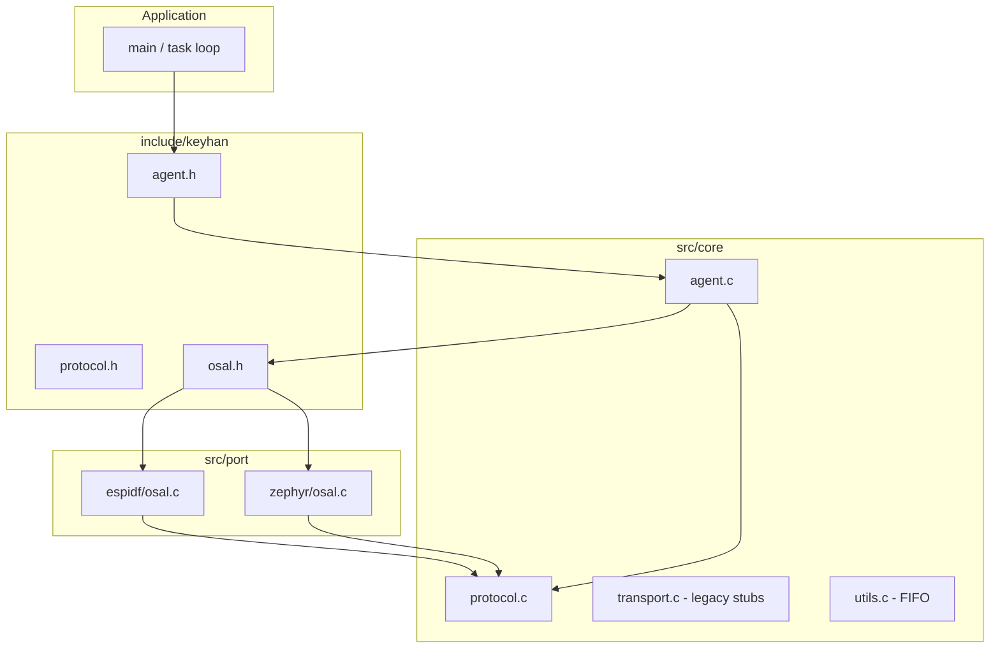
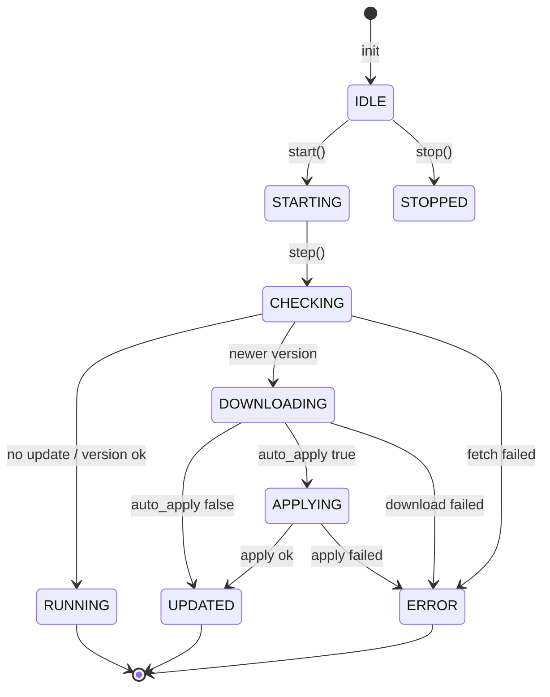

# Keyhan Developer Guide

Technical reference for contributors and engineers porting Keyhan to new RTOSes or MCUs. Covers architecture, module boundaries, build integration, the OTA protocol, and extension points.

---

## Table of contents

1. [Design goals](#design-goals)
2. [Architecture overview](#architecture-overview)
3. [Source layout](#source-layout)
4. [Agent state machine](#agent-state-machine)
5. [Public API reference](#public-api-reference)
6. [OSAL contract](#osal-contract)
7. [OTA protocol v1](#ota-protocol-v1)
8. [Error model](#error-model)
9. [Utilities](#utilities)
10. [Build and integration](#build-and-integration)
11. [Porting checklist](#porting-checklist)
12. [IDE and static analysis](#ide-and-static-analysis)
13. [Known limitations and API drift](#known-limitations-and-api-drift)

---

## Design goals

| Goal | How it is achieved |
|------|---------------------|
| **Portability** | Core logic is C99 with no RTOS calls; HTTP/flash live in `src/port/*` |
| **Small footprint** | Single agent struct, synchronous `step()` driver, no background thread inside the library |
| **Explicit control** | Application calls `keyhan_agent_step()` when to check for updates |
| **Testability** | `osal_ops_override` injects mock fetch/download/apply |
| **Stable wire format** | Versioned binary manifest with magic footer |

Non-goals in the current tree: TLS policy, delta updates, rollback orchestration, and background workers inside the library.

---

## Architecture overview



**Dependency rule:** `src/core` must not include ESP-IDF or Zephyr headers. Ports include core headers and platform SDKs.

---

## Source layout

```
keyhan/
├── include/keyhan/
│   ├── agent.h          Agent lifecycle, config, states
│   ├── osal.h           Update descriptor, OSAL vtable, staging types
│   ├── protocol.h       Wire format constants and manifest parser
│   ├── error.h          keyhan_agent_error_t and KEYHAN_AGENT_ERROR_TO_NAME
│   ├── transport.h      Legacy transport API (unsupported)
│   ├── utils.h          Ring-buffer FIFO helper
│   └── ports/           Port-specific headers (Zephyr ctx — partially commented)
├── src/
│   ├── internal.h       struct keyhan_agent definition
│   ├── core/
│   │   ├── agent.c      State machine and step() orchestration
│   │   ├── protocol.c   keyhan_protocol_parse_manifest_v1()
│   │   ├── transport.c  Returns KEYHAN_AGENT_ERR_NOT_SUPPORTED
│   │   ├── utils.c      FIFO implementation
│   │   └── error.c      (reserved; string macro lives in error.h)
│   └── port/
│       ├── espidf/osal.c   g_keyhan_osal_ops for ESP-IDF HTTP client
│       └── zephyr/osal.c   g_keyhan_zephyr_osal_ops (ctx-based; see drift note)
├── ports/esp32/keyhan/   ESP-IDF component (CMakeLists.txt)
└── example/              Reference apps
```

---

## Agent state machine

Implementation: `src/core/agent.c`



### `keyhan_agent_step()` algorithm

1. Set state `CHECKING`.
2. `ops->fetch_update_info(manifest_url, device_token, &latest)`.
   - On `KEYHAN_AGENT_ERR_NO_UPDATE` → `RUNNING`, return OK.
   - On other errors → `ERROR`, invoke `on_error`, return err.
3. If `latest.version <= cfg.current_version` → `RUNNING`, return OK.
4. Copy to `agent->pending`, set `DOWNLOADING`, call `download_and_stage` with optional `on_progress`.
5. If `!auto_apply` → `UPDATED`, `on_update_ready`, return OK.
6. Set `APPLYING`, `apply_staged_update(latest.version, auto_reboot)`.
7. On success, bump `cfg.current_version`, set `UPDATED`.

**Thread safety:** Not synchronized. One agent instance should be driven from one task, or guarded by a mutex in the application.

**Persistence:** The library does not save `current_version` to NVS; the application or OSAL must do that after apply.

---

## Public API reference

### Lifecycle

```c
keyhan_agent_error_t keyhan_agent_init(keyhan_agent_t **agent_out,
                                       const keyhan_agent_config_t *cfg);
keyhan_agent_error_t keyhan_agent_start(keyhan_agent_t *agent);
keyhan_agent_error_t keyhan_agent_step(keyhan_agent_t *agent);
keyhan_agent_error_t keyhan_agent_stop(keyhan_agent_t *agent);
keyhan_agent_error_t keyhan_agent_deinit(keyhan_agent_t *agent);
```

| Function | Behavior |
|----------|----------|
| `init` | Allocates agent, copies config, resolves `osal_ops` (override or `g_keyhan_osal_ops`) |
| `start` | Sets `STARTING`, calls `step()` once |
| `step` | Full check/download/apply cycle |
| `stop` | Sets `STOPPED` |
| `deinit` | `free(agent)` |

### Configuration (`keyhan_agent_config_t`)

Defined in `include/keyhan/agent.h`. The agent stores a **copy** of the config struct; pointers (`manifest_url`, `device_token`) must remain valid for the agent lifetime.

### Update descriptor (`keyhan_agent_update_t`)

Defined in `include/keyhan/osal.h`:

```c
typedef struct {
  int version;
  uint32_t image_size;
  char image_url[256];
} keyhan_agent_update_t;
```

The protocol parser populates the same logical fields. Headers refer to `keyhan_ota_update_info_t` in `protocol.h`; that typedef should alias `keyhan_agent_update_t` — if missing in your checkout, treat them as identical when porting.

### Legacy transport API

`keyhan_agent_transport_*` in `src/core/transport.c` always returns `KEYHAN_AGENT_ERR_NOT_SUPPORTED`. Do not use for new code; the OSAL vtable replaced this design.

---

## OSAL contract

### Vtable (`keyhan_osal_ota_ops_t`)

```c
typedef struct {
  keyhan_agent_error_t (*fetch_update_info)(const char *manifest_url,
                                            const char *device_token,
                                            keyhan_agent_update_t *out_info);
  keyhan_agent_error_t (*download_and_stage)(
      const keyhan_agent_update_t *info,
      keyhan_ota_progress_cb_t progress_cb,
      void *progress_user);
  keyhan_agent_error_t (*apply_staged_update)(int target_version,
                                              int auto_reboot);
} keyhan_osal_ota_ops_t;

extern const keyhan_osal_ota_ops_t g_keyhan_osal_ops;  /* ESP-IDF */
```

### `fetch_update_info`

**Must:**

- Perform HTTP `GET` on `manifest_url`.
- Set header `KEYHAN_OTA_PROTOCOL_HEADER_DEVICE_TOKEN` (`X-Device-Token`) to `device_token`.
- Read response body into a buffer and call `keyhan_protocol_parse_manifest_v1()`.
- Fill `out_info` on success.

**May return:**

- `KEYHAN_AGENT_ERR_NO_UPDATE` — agent transitions to `RUNNING` (not emitted by stock ESP-IDF port today).
- `KEYHAN_AGENT_ERR_NETWORK`, `KEYHAN_AGENT_ERR_INTEGRITY`, etc.

### `download_and_stage`

**Must:**

- `GET` `info->image_url`.
- Stream bytes; call `progress_cb(downloaded, info->image_size, progress_user)` when non-NULL.
- If `info->image_size != 0`, verify total downloaded bytes match.

**Should:**

- Write chunks to OTA partition or `keyhan_staging_t::write_chunk` in a full port.

Stock ESP-IDF implementation buffers in RAM only (validates size, does not flash write).

### `apply_staged_update`

**Must:**

- Finalize staged image (boot partition swap, NVS version, checksum verify).
- If `auto_reboot` non-zero, restart the device when appropriate.

Stock ESP-IDF implementation calls `esp_restart()` when `auto_reboot` is set; otherwise returns OK without persisting version (application must persist).

### Staging helper type (optional)

```c
typedef struct {
  keyhan_agent_error_t (*write_chunk)(void *user, const uint8_t *data, size_t len);
  keyhan_agent_error_t (*commit)(void *user, int version, bool reboot);
  void *user;
} keyhan_staging_t;
```

Not wired into `agent.c` yet; use inside custom `download_and_stage` / `apply_staged_update` implementations.

### Override for tests

```c
keyhan_agent_config_t cfg = {
    ...
    .osal_ops_override = &mock_ops,
};
```

---

## OTA protocol v1

Constants (`include/keyhan/protocol.h`):

| Symbol | Value |
|--------|--------|
| `KEYHAN_OTA_PROTOCOL_VERSION` | `1` |
| `KEYHAN_OTA_MSG_TYPE_MANIFEST` | `1` |
| `KEYHAN_OTA_PROTOCOL_FOOTER_MAGIC` | `0xDEADBEEF` |
| `KEYHAN_OTA_PROTOCOL_MAX_BODY_LEN` | `512` |

### Wire layout (little-endian)

```
Offset   Size     Field
------   ----     -----
0        1        version  (= 1)
1        4        msg_len  (body length only)
5        1        msg_type (= KEYHAN_OTA_MSG_TYPE_MANIFEST)
6        4        target_version (int32)
10       4        image_size (uint32)
14       2        image_url_len (uint16)
16       N        image_url (raw bytes, NOT null-terminated on wire)
16+N     4        footer_magic (uint32 LE = 0xDEADBEEF)
```

**Total frame size:** `6 + msg_len + 4` bytes.

**Validation** (`keyhan_protocol_parse_manifest_v1`):

- `payload_len == 6 + msg_len + 4`
- `msg_len >= 10` and `msg_len <= KEYHAN_OTA_PROTOCOL_MAX_BODY_LEN`
- `image_url_len + 10 == msg_len`
- `0 < image_url_len < sizeof(out_info->image_url)`
- Footer magic matches
- `target_version >= 0`

### Example: building a manifest (Python)

```python
import struct

def build_manifest(target_version: int, image_size: int, image_url: str) -> bytes:
    url_bytes = image_url.encode("ascii")
    body = struct.pack("<iIH", target_version, image_size, len(url_bytes)) + url_bytes
    header = struct.pack("<BIB", 1, len(body), 1)  # version, msg_len, msg_type
    footer = struct.pack("<I", 0xDEADBEEF)
    return header + body + footer
```

### HTTP headers

| Header | Constant | Usage |
|--------|----------|--------|
| `X-Device-Token` | `KEYHAN_OTA_PROTOCOL_HEADER_DEVICE_TOKEN` | Manifest request authentication |
| `Accept` | `KEYHAN_OTA_PROTOCOL_HEADER_ACCEPT` | `application/octet-stream` |

---

## Error model

Errors are negative integers (`keyhan_agent_error_t`). Defined via X-macro in `include/keyhan/error.h`.

| Code | Name | Typical cause |
|------|------|----------------|
| `0` | `KEYHAN_AGENT_OK` | Success |
| `-1` | `KEYHAN_AGENT_ERR_INVALID_ARG` | NULL pointer, bad config |
| `-2` | `KEYHAN_AGENT_ERR_NO_MEM` | `calloc` failed |
| `-3` | `KEYHAN_AGENT_ERR_OS` | NVS/flash/platform failure |
| `-4` | `KEYHAN_AGENT_ERR_STATE` | Invalid transition (reserved) |
| `-5` | `KEYHAN_AGENT_ERR_UNINITIALIZED` | NULL agent |
| `-6` | `KEYHAN_AGENT_ERR_BUFFER_FULL` | FIFO push when full |
| `-7` | `KEYHAN_AGENT_ERR_BUFFER_EMPTY` | FIFO pop when empty |
| `-8` | `KEYHAN_AGENT_ERR_NO_MEMORY` | FIFO buffer alloc failed |
| `-9` … `-12` | `INVALIDE_RES_*` | Legacy resource parsing (reserved) |
| `-13` | `KEYHAN_AGENT_ERR_NO_UPDATE` | Server: nothing to install |
| `-14` | `KEYHAN_AGENT_ERR_NETWORK` | HTTP/socket failure |
| `-15` | `KEYHAN_AGENT_ERR_INTEGRITY` | Protocol/size/footer mismatch |
| `-16` | `KEYHAN_AGENT_ERR_NOT_SUPPORTED` | Legacy transport API |

Compile-time name helper (C11 `_Generic`):

```c
KEYHAN_AGENT_ERROR_TO_NAME(err)
```

---

## Utilities

### FIFO (`keyhan_utils_fifo_*`)

Ring buffer of fixed-size items in `src/core/utils.c`. Used for future transport queuing; not referenced by `agent.c` today.

```c
keyhan_utils_fifo_init(&fifo, item_size, capacity);
keyhan_utils_fifo_push(fifo, &item);
keyhan_utils_fifo_pop(fifo, &out);
keyhan_utils_fifo_deinit(fifo);
```

`deinit` frees the buffer but does not `free()` the fifo struct itself — match allocation style of your caller.

---

## Build and integration

### ESP-IDF component

`ports/esp32/keyhan/CMakeLists.txt`:

```cmake
idf_component_register(
    SRC_DIRS "../../../src/core" "../../../src/port/espidf"
    INCLUDE_DIRS "../../../include/" "../../../src/"
    PRIV_REQUIRES esp_event esp_http_client esp_netif esp-tls
)
```

Project `CMakeLists.txt` adds:

```cmake
list(APPEND EXTRA_COMPONENT_DIRS path/to/ports/esp32/keyhan)
```

Application depends on `keyhan` and links `g_keyhan_osal_ops` automatically.

### Zephyr

`example/zephyr-esp32` includes headers from `../../include` and expects Zephyr OSAL symbols. The Zephyr port source (`src/port/zephyr/osal.c`) uses a **context-first** function signature that does not match `keyhan_osal_ota_ops_t` in `osal.h` without an adapter layer — treat Zephyr support as **in progress** when porting.

Suggested Zephyr integration steps:

1. Add `src/core/*.c` and a thin adapter that wraps `g_keyhan_zephyr_osal_ops` into `keyhan_osal_ota_ops_t`, or align Zephyr functions with the ESP-IDF signatures.
2. Uncomment/restore `include/keyhan/ports/zephyr_osal.h`.
3. Update `example/zephyr-esp32/src/main.c` to use `keyhan_agent_config_t` (same as ESP-IDF example).

### Host / unit tests

Build core + mock OSAL on the host with CMake:

```cmake
add_library(keyhan_core
  src/core/agent.c
  src/core/protocol.c
)
target_include_directories(keyhan_core PUBLIC include src)
```

Inject `osal_ops_override` with fake HTTP payloads as byte arrays.

---

## Porting checklist

1. **Implement `keyhan_osal_ota_ops_t`** (or adapter) with three functions matching ESP-IDF signatures.
2. **HTTP client** — manifest GET with `X-Device-Token`; image GET with streaming read loop.
3. **Call `keyhan_protocol_parse_manifest_v1`** on manifest body; do not parse JSON in the agent path.
4. **Staging** — `write_chunk` to flash driver; track `image_size` for progress and integrity.
5. **Apply** — board-specific OTA API (ESP `esp_ota_set_boot_partition`, MCUboot, etc.).
6. **Version persistence** — update NVS/EEPROM when apply succeeds.
7. **Wire `keyhan_agent_config_t`** in application init.
8. **Test** — manifest too large, bad footer, truncated download, `auto_apply` false path.

---

## IDE and static analysis

`scripts/setup-clangd.sh` generates `.clangd` for ESP-IDF Xtensa toolchain headers and symlinks `compile_commands.json` from `example/esp32-sync-http/build`.

```bash
# After at least one idf.py build in the example:
./scripts/setup-clangd.sh
```

Core headers under `include/` and `src/` use synthetic `-I` flags; example sources use the compilation database from the ESP-IDF build.

---

## Known limitations and API drift

Track these when reading older examples or branches:

| Area | Status |
|------|--------|
| `keyhan_ota_update_info_t` vs `keyhan_agent_update_t` | Same role; typedef should be unified in headers |
| `include/keyhan/ports/espidf_osal.h` | Referenced by ESP port; may be empty or missing — ops live in `osal.c` |
| `include/keyhan/ports/zephyr_osal.h` | Mostly commented out |
| Zephyr `g_keyhan_zephyr_osal_ops` | Function pointers take `void *ctx` first — mismatches `keyhan_osal_ota_ops_t` |
| `example/zephyr-esp32` | Uses deprecated `keyhan_agent_init(agent, &devinfo, &params, &cb)` |
| Transport API | Stub only |
| ESP-IDF `apply_staged_update` | Does not write OTA partition in stock port |
| `KEYHAN_AGENT_ERR_NO_UPDATE` | Handled in agent; ports should return it for empty/up-to-date server responses |
| `keyhan_staging_t` | Declared but not used by agent core |

**Reference implementation:** `example/esp32-sync-http` + `src/port/espidf/osal.c` + `src/core/agent.c`.

---

## Related documents

- [User Guide](user-guide.md) — integration steps, server setup, troubleshooting
- [README](../README.md) — repository overview and quick start
